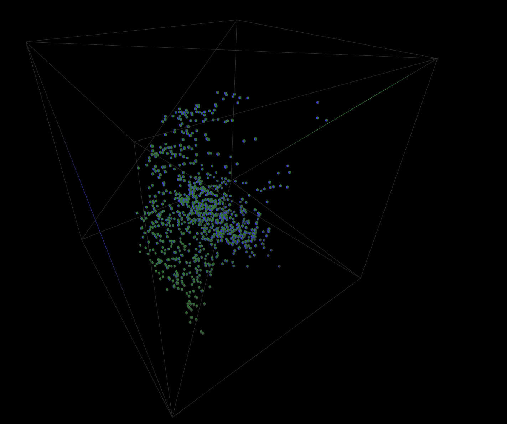

# Boids

Experimenting with Boids flocking algorithm in 3D using Three.js / React Fiber.

https://daniel-const.github.io/boids-three/



## Get started

```bash
npm install
npm run dev
```

## References

- https://vanhunteradams.com/Pico/Animal_Movement/Boids-algorithm.html